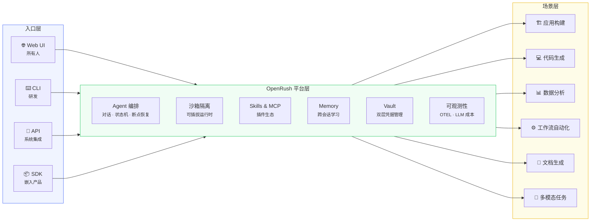
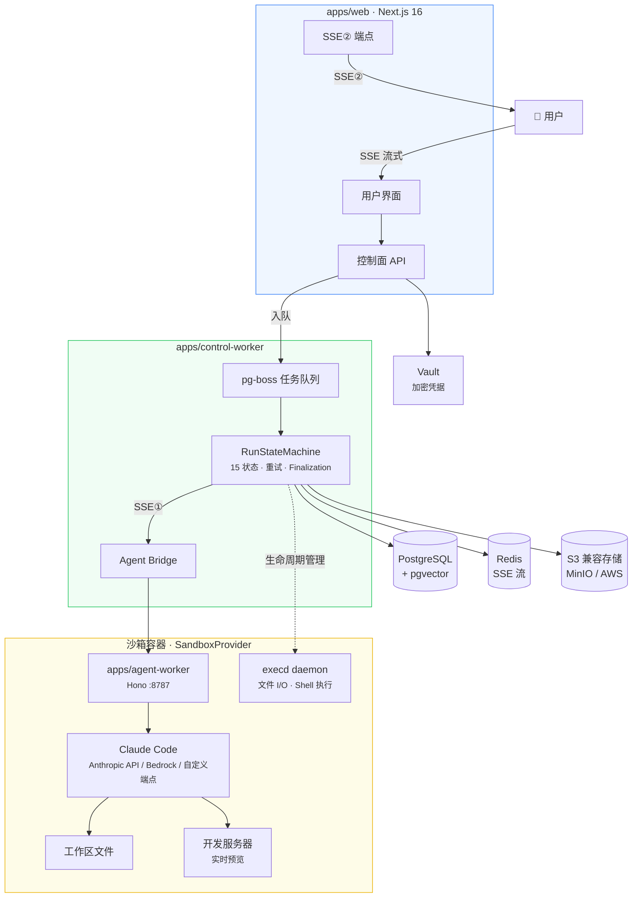
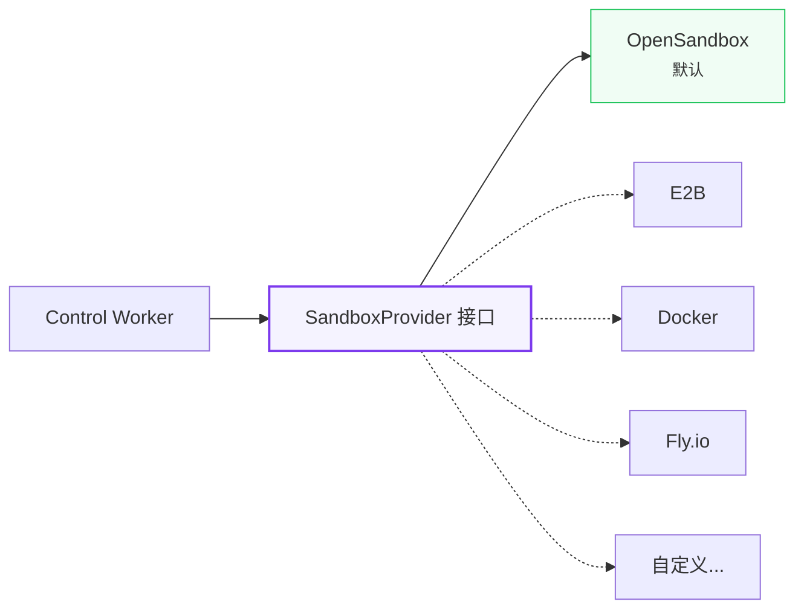
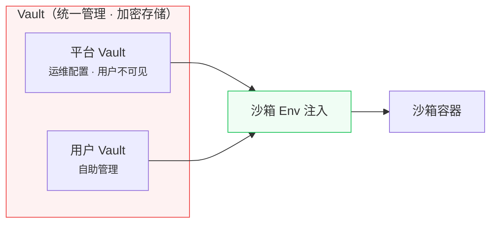

# OpenRush

> **Run managed agents on your own infrastructure. Claude Code native. Registry included.**

<p>
  
  
  
  
  
  
</p>

OpenRush is an open-source **managed-agents platform for Claude Code** that you deploy on your own infrastructure. One install gives you a stable `/api/v1/*` contract, sandboxed execution, a Registry for Agents / Skills / MCP servers, dual-layer Vault, and an AI SDK–native UIMessage event stream.

## Why OpenRush

Enterprises are asking how to put AI agents to work without locking into a vendor cloud, stitching together fragile tooling, or rebuilding from scratch. OpenRush takes a different path.

**Deploy once on your own infrastructure, then let everyone — engineers and non-engineers — use Claude Code agents for everyday work.** Engineers drive it through the CLI/API. Product teams build apps through conversation. Data teams run analyses in plain language. Every task runs inside a sandbox, with credentials encrypted, permissions scoped, and data kept inside your network.

We believe the future of enterprise software isn't "AI features stapled onto existing tools" — it's **AI agents as the primary interface**, supported by the right infrastructure: sandbox isolation, credential safety, pluggable capability, observable operations.

OpenRush is that infrastructure, open-sourced.

## How OpenRush compares

### vs. `openclaw-managed-agents`

OpenRush and [`openclaw-managed-agents`](https://github.com/openclaw/openclaw-managed-agents) share the same north star — self-hosted Claude Code execution — but take different bets on what comes bundled:

| Area | `openclaw-managed-agents` | **OpenRush** |
| --- | --- | --- |
| Positioning | Minimal managed-agents runtime | Opinionated platform — runtime **+** Registry **+** Vault **+** UI |
| Registry | Bring your own | **Built-in** — AgentDefinitions (versioned), Skills, MCP servers first-class |
| Persistence | Ephemeral / file-based | **PostgreSQL 16 + pgvector** — 13 tables, migrations, cross-session memory |
| Event stream | Custom | **AI SDK v6 UIMessageChunk** native — `useChat` zero-change, Redis-backed resumable SSE, `Last-Event-ID` reconnect |
| Version control | — | AgentDefinition **immutable versioning** (`PATCH` ⇒ new version, `If-Match` optimistic concurrency) |
| Credentials | Env / file | **Dual-layer Vault** — platform (admin-managed) + user (self-service), sandbox env injection |
| API contract | Implementation-defined | Stable `/api/v1/*`, Zod-typed, OpenAPI spec, `@open-rush/sdk` |
| Sandbox | Single implementation | Pluggable `SandboxProvider` — OpenSandbox default, swap to E2B / Docker / Fly |
| Web UI | — | First-class: project management, conversation history, preview |

**Shorthand**: `openclaw-managed-agents` is a runtime; OpenRush is a platform that includes the runtime.

### vs. adjacent categories

OpenRush is not a replacement for any single tool — it unifies several scenarios on a self-hosted platform.

| Scenario | Comparable offerings | How OpenRush differs |
| --- | --- | --- |
| AI site building | [bolt.new](https://bolt.new) · [Lovable](https://lovable.dev) · [v0](https://v0.dev) | Self-hosted, not just site building, enterprise-grade permissions + credentials |
| AI coding | [Cursor](https://cursor.com) · [Windsurf](https://windsurf.com) | Not an IDE plugin — a platform service usable by non-engineers |
| Managed-agent runtimes | [Anthropic Managed Agents](https://platform.claude.com/docs/en/managed-agents/overview) · [E2B](https://e2b.dev) · `openclaw-managed-agents` | Self-hosted, pluggable sandbox, no cloud lock-in, Registry included |
| Agent orchestration | [LangGraph](https://www.langchain.com/langgraph) · [CrewAI](https://www.crewai.com) | Built-in sandbox execution — not just an orchestration library |
| Enterprise AI platforms | Vendor-proprietary suites | Open source, Claude Code native, Skills/MCP ecosystem |

**In one line**: others make a tool for one scenario; OpenRush is the infrastructure that carries them all.

## 愿景

> 一次部署，全员可用。多种入口接入，多种场景覆盖，统一平台承载。



**当前 scope（M0–M4）：** 平台层 + 应用构建场景 + Web UI 入口。CLI、API、SDK 及更多场景在 GA 之后推进。

## 架构

三层设计 —— 用户请求经控制面编排，在沙箱容器中由 Claude Code 执行，结果流式返回。



### 沙箱可插拔



`SandboxProvider` 是公开接口。OpenSandbox 是内置默认实现，社区可贡献其他实现。通过环境变量一键切换：`SANDBOX_PROVIDER=opensandbox | e2b | docker`

### 凭据安全



Vault 统一管理所有凭据（加密存储），运行时注入沙箱环境变量。平台 Vault 对用户不可见。

后续增强（可选）：对 HTTP API 类凭据启用 Credential Proxy，密钥不进容器。

## 平台能力

| 能力             | 说明                                             |
| ---------------- | ------------------------------------------------ |
| **Agent 编排**   | 对话、任务分发、15 状态机、断点恢复、流式中间件  |
| **沙箱隔离**     | 每任务独立容器，可插拔运行时，资源限制，网络策略 |
| **Skills & MCP** | 插件市场 + Model Context Protocol 服务器扩展     |
| **Memory**       | 跨会话学习、用户偏好、pgvector 向量搜索          |
| **Vault**        | 双层凭据（平台 + 用户），加密存储，env 注入沙箱  |
| **多租户**       | 用户隔离、项目隔离、RBAC 权限控制                |
| **可观测性**     | OpenTelemetry traces + metrics + LLM 成本追踪    |

## 设计原则

- **自托管优先** —— 你的数据、你的基础设施、你的规则
- **Claude Code 原生** —— 三种连接模式：Anthropic API / AWS Bedrock / 自定义端点
- **安全默认** —— 双层 Vault 加密存储，沙箱 env 注入，可选 Credential Proxy 增强
- **可插拔** —— 沙箱、存储、认证、可观测后端均可替换
- **零供应商锁定** —— 标准 OTEL、NextAuth.js、S3 兼容、Drizzle ORM

## 技术栈

| 层     | 技术                                               |
| ------ | -------------------------------------------------- |
| 前端   | Next.js 16, React 19, Tailwind 4, shadcn/ui        |
| 后端   | Hono (agent), pg-boss (队列), Drizzle ORM          |
| AI     | Claude Code (Anthropic API / Bedrock / 自定义端点) |
| 数据库 | PostgreSQL 16 + pgvector                           |
| 沙箱   | 可插拔 SandboxProvider                             |
| 缓存   | Redis (可恢复 SSE 流)                              |
| 存储   | S3 兼容 (MinIO / AWS)                              |
| 认证   | NextAuth.js v5                                     |
| 可观测 | OpenTelemetry                                      |

## Project status

| Milestone | Status | Focus |
| --- | --- | --- |
| M0: Skeleton | ✅ Done | Infra, sandbox PoC, security baseline |
| M1: Agent loop | ✅ Done | In-sandbox Claude Code execution, Web API, SSE streaming |
| M2: MVP core | ✅ Done | Project management, conversation history, Finalization, Recovery |
| M3: Experience | ✅ Done | Vault injection, Skills, MCP, Memory |
| M4: Managed-agents API | 🚧 In progress | Stable `/api/v1/*`, AgentDefinition versioning, Service Tokens, OpenAPI spec, E2E |

Full plan in [`docs/roadmap.md`](docs/roadmap.md). The M4 task breakdown and live status lives in [`docs/execution/TASKS.md`](docs/execution/TASKS.md).

## Quickstart (3 steps)

> Full walkthrough — curl samples, troubleshooting, SSE reconnect — in [`docs/quickstart.md`](docs/quickstart.md).

### 1. Install and start the platform

```bash
# Prereqs: Node.js 22+, pnpm 10+, Docker
git clone https://github.com/kanyun-rush/open-rush.git
cd open-rush
pnpm install

# Postgres + Redis + MinIO via Docker Compose
pnpm db:up
pnpm db:push

# Configure env (edit each .env.local after copying)
cp apps/web/.env.example           apps/web/.env.local
cp apps/control-worker/.env.example apps/control-worker/.env.local
cp apps/agent-worker/.env.example   apps/agent-worker/.env.local

pnpm dev                # http://localhost:3000
```

Set `ANTHROPIC_API_KEY` (or Bedrock creds), and create a GitHub OAuth App ([Developer Settings](https://github.com/settings/developers)) with callback `http://localhost:3000/api/auth/callback/github` to populate `AUTH_GITHUB_ID` / `AUTH_GITHUB_SECRET`.

### 2. Mint a service token

Sign into the Web UI, go to **Settings → API Tokens → New token**, pick scopes (e.g. `agents:write`, `runs:write`, `runs:read`, `runs:cancel`), and copy the plaintext `sk_...` once. Token creation is session-gated — service tokens cannot mint service tokens.

```bash
export OPENRUSH_BASE=http://localhost:3000
export OPENRUSH_TOKEN=sk_...
export OPENRUSH_PROJECT=<project-uuid>
```

### 3. Create an Agent and stream its run

```bash
# Create an AgentDefinition (blueprint)
DEF=$(curl -s -X POST "$OPENRUSH_BASE/api/v1/agent-definitions" \
  -H "Authorization: Bearer $OPENRUSH_TOKEN" \
  -H 'Content-Type: application/json' \
  -d "{\"projectId\":\"$OPENRUSH_PROJECT\",\"name\":\"echo-bot\",\"providerType\":\"claude-code\",\"model\":\"claude-sonnet-4-5\",\"systemPrompt\":\"You are concise.\",\"allowedTools\":[\"Bash\",\"Read\",\"Write\"],\"skills\":[],\"mcpServers\":[],\"maxSteps\":20,\"deliveryMode\":\"chat\"}" \
  | jq -r '.data.id')

# Create an Agent + first Run
RUN=$(curl -s -X POST "$OPENRUSH_BASE/api/v1/agents" \
  -H "Authorization: Bearer $OPENRUSH_TOKEN" \
  -H 'Content-Type: application/json' \
  -d "{\"projectId\":\"$OPENRUSH_PROJECT\",\"definitionId\":\"$DEF\",\"mode\":\"chat\",\"initialInput\":\"List /tmp and count files.\"}")
AGENT_ID=$(echo "$RUN" | jq -r '.data.agent.id')
RUN_ID=$(echo "$RUN" | jq -r '.data.firstRunId')

# Stream events (AI SDK UIMessageChunk + data-openrush-* extensions)
curl -N "$OPENRUSH_BASE/api/v1/agents/$AGENT_ID/runs/$RUN_ID/events" \
  -H "Authorization: Bearer $OPENRUSH_TOKEN"
```

SSE reconnect uses `Last-Event-ID` (no query cursor). See [`specs/managed-agents-api.md` §事件协议](specs/managed-agents-api.md) for the full protocol.

## API reference

- **[`docs/api.md`](docs/api.md)** — endpoint index, auth, error codes, SSE format.
- **[`specs/managed-agents-api.md`](specs/managed-agents-api.md)** — binding API contract.
- **OpenAPI spec** — machine-readable document, planned at `docs/specs/openapi-v0.1.yaml` (delivered in task-15).
- **`@open-rush/sdk`** — typed TypeScript client with built-in SSE + `Last-Event-ID` reconnect (delivered in task-16).

Until the OpenAPI spec and SDK are merged, the authoritative types live in [`packages/contracts/src/v1/`](packages/contracts/src/v1) and the curl samples above give you a working integration.

## Contributors

| GitHub                                                                                   | 方向                                                                               |
| ---------------------------------------------------------------------------------------- | ---------------------------------------------------------------------------------- |
| [@pandoralink](https://github.com/pandoralink)                                           | Web 交互体验、AI 对话链路、可观测平台前端                                          |
| [@yanglx-lara](https://github.com/yanglx-lara)                                           | CLI 工具链、[reskill](https://github.com/nicepkg/reskill) 包管理器、可观测平台前端 |
| [@yongchaoo](https://github.com/yongchaoo) · [luocy010@163.com](mailto:luocy010@163.com) | MCP 运行时、Agent 交付模式、前端可观测性                                           |

以上贡献者目前正在看新的机会，欢迎联系。

## Contributing

We build in the open. Contributions welcome — see [CONTRIBUTING.md](CONTRIBUTING.md) for the workflow (Spec-first + Sparring Review).

If you care about AI agent infrastructure or share our direction, we'd love to have you. Filing issues, sending PRs, or simply starring the repo all help.

## License

[MIT](LICENSE)
